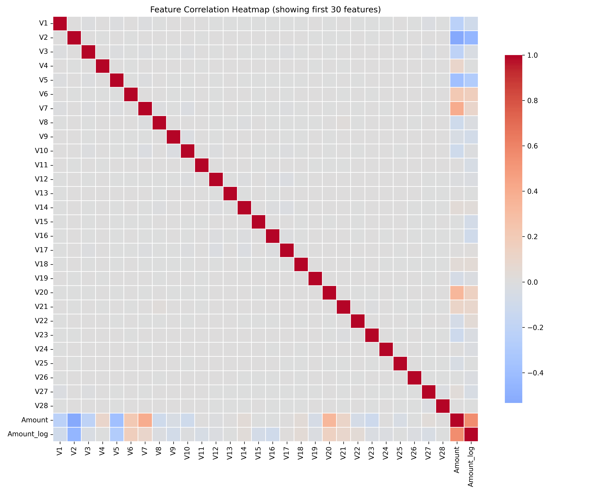
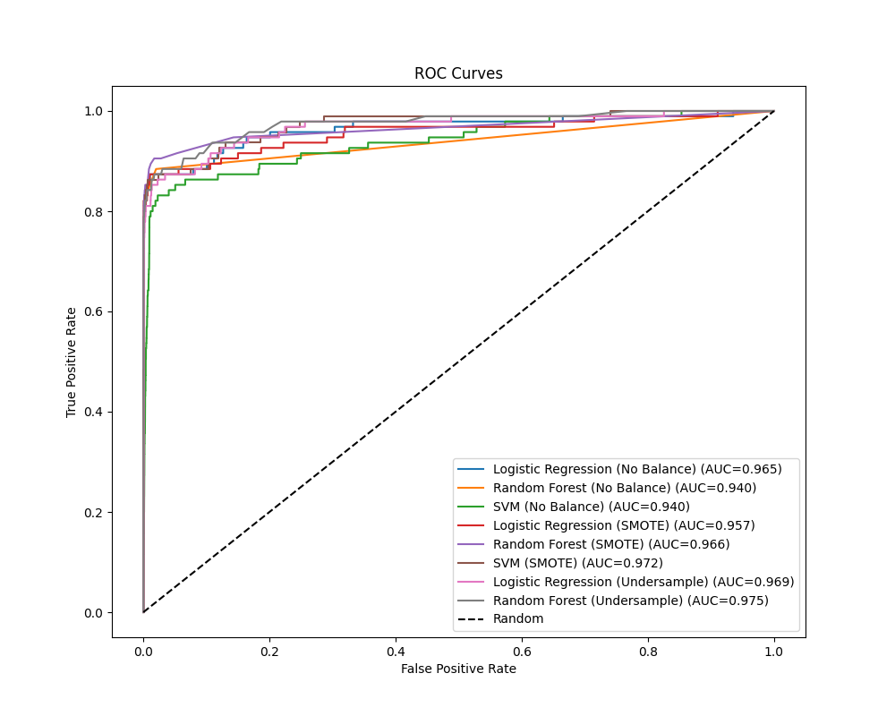
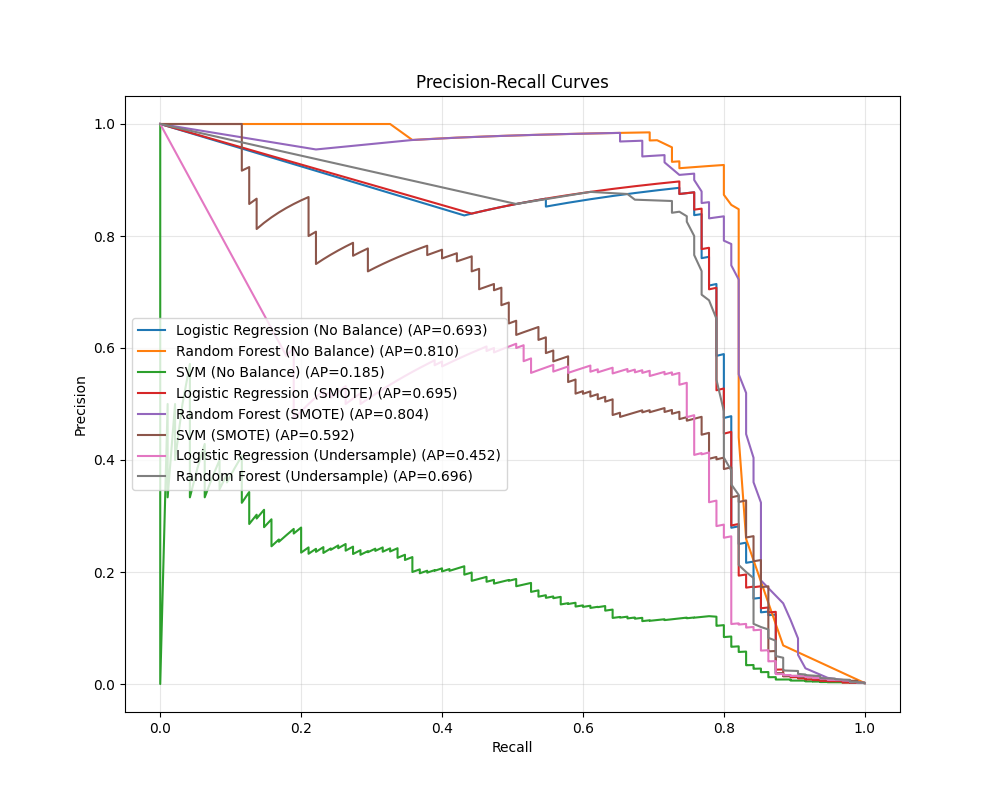
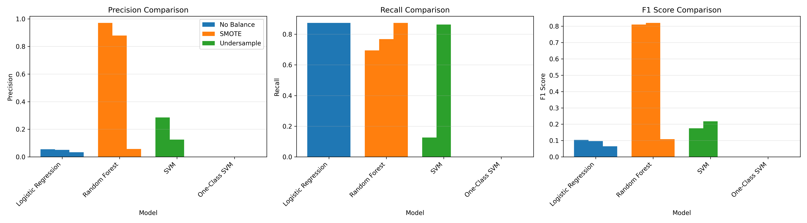
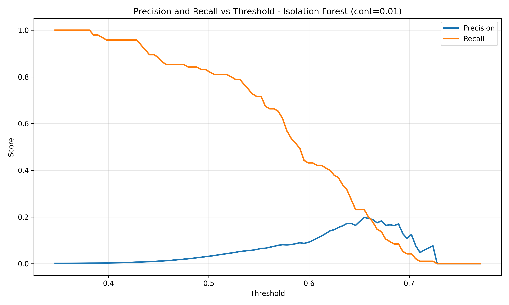
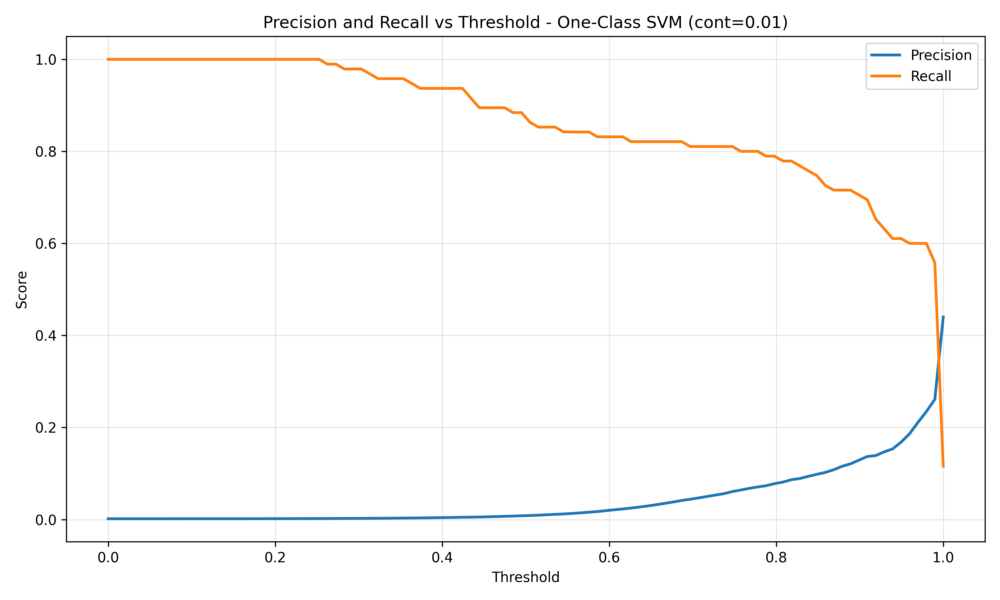
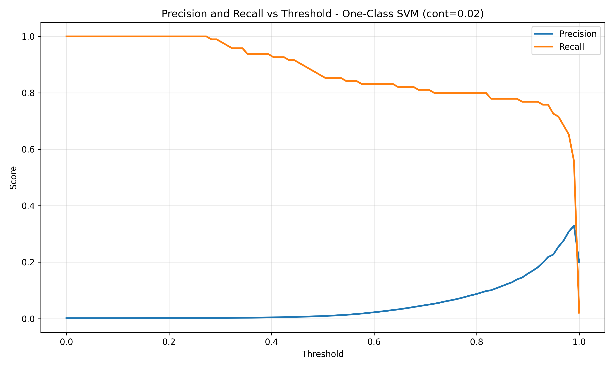
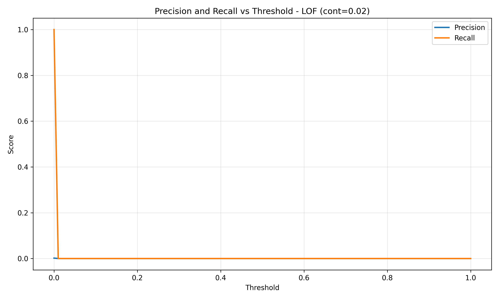

# Credit Card Fraud Detection Using Machine Learning

**Author:** Neethu Mohanan  
**Project Type:** College Project  
**Domain:** Machine Learning, Anomaly Detection, Fraud Detection

---

## Abstract

Credit card fraud is a significant problem in the financial industry, causing billions of dollars in losses annually. This project implements and compares multiple machine learning approaches for detecting fraudulent credit card transactions. The project addresses the critical challenge of class imbalance in fraud detection datasets, where fraudulent transactions represent less than 1% of all transactions. We evaluate supervised learning algorithms (Logistic Regression, Random Forest, Support Vector Machine), unsupervised anomaly detection methods (Isolation Forest, One-Class SVM, Local Outlier Factor), and deep learning approaches (Autoencoder). The models are trained and evaluated on the Kaggle Credit Card Fraud Detection dataset containing 284,807 transactions. Our results demonstrate that Random Forest with SMOTE balancing achieves the best performance with an F1-Score of 0.820, Precision of 0.880, and Recall of 0.768, making it suitable for real-time fraud detection systems.

---

## Table of Contents

1. [Introduction](#introduction)
2. [Problem Statement](#problem-statement)
3. [Objectives](#objectives)
4. [Dataset Description](#dataset-description)
5. [Methodology](#methodology)
6. [Implementation](#implementation)
7. [Results and Analysis](#results-and-analysis)
8. [Conclusion](#conclusion)
9. [Future Work](#future-work)
10. [References](#references)
11. [Installation and Usage](#installation-and-usage)

---

## Introduction

Credit card fraud detection is a critical application of machine learning in the financial sector. With the increasing volume of online transactions, automated fraud detection systems have become essential. However, fraud detection presents unique challenges:

- **Extreme Class Imbalance:** Fraudulent transactions typically represent less than 1% of all transactions
- **Evolving Fraud Patterns:** Fraudsters continuously adapt their methods
- **Cost of Errors:** False positives (blocking legitimate transactions) and false negatives (missing fraud) both have significant costs
- **Real-time Requirements:** Detection must occur in milliseconds for online transactions

This project addresses these challenges by implementing and comparing multiple machine learning approaches, with a focus on handling class imbalance and reducing false positives.

---

## Problem Statement

The primary problem addressed in this project is:

**"How can we effectively detect fraudulent credit card transactions using machine learning while minimizing false positives and maintaining high recall?"**

Key challenges:
1. Detecting fraud in highly imbalanced datasets (99.83% normal, 0.17% fraud)
2. Reducing false positive rates to minimize customer inconvenience
3. Achieving high recall to catch maximum fraud cases
4. Comparing different machine learning paradigms (supervised vs unsupervised vs deep learning)

---

## Objectives

### Primary Objectives
1. Implement multiple machine learning models for fraud detection
2. Compare supervised, unsupervised, and deep learning approaches
3. Evaluate the impact of different class imbalance handling techniques
4. Identify the best-performing model for fraud detection

### Secondary Objectives
1. Analyze the trade-off between precision and recall
2. Understand the effect of threshold selection on model performance
3. Generate comprehensive visualizations for model comparison
4. Provide recommendations for real-time deployment

---

## Dataset Description

### Dataset Source
Kaggle Credit Card Fraud Detection Dataset  
URL: https://www.kaggle.com/datasets/mlg-ulb/creditcardfraud

### Dataset Characteristics
- **Total Transactions:** 284,807
- **Features:** 31 (28 PCA-transformed features V1-V28, Amount, Time, Class)
- **Normal Transactions:** 284,315 (99.83%)
- **Fraudulent Transactions:** 492 (0.17%)
- **Imbalance Ratio:** ~578:1
- **Missing Values:** None
- **Duplicates:** 1,081 (removed during preprocessing)

### Data Preprocessing
- Removed 1,081 duplicate transactions
- Created log-transformed feature: `Amount_log = log(Amount + 1)`
- Standardized all features using StandardScaler
- Stratified train/validation/test split (70%/10%/20%)

---

## Methodology

### 1. Data Preprocessing Pipeline

#### Cleaning
- Duplicate removal
- Missing value handling (median imputation)
- Outlier detection and handling

#### Feature Engineering
- Log transformation of transaction amounts
- Time-based feature extraction (hour, cyclic encoding)
- Feature scaling (StandardScaler for all models)

#### Data Splitting
- Stratified split to preserve fraud ratio across sets
- Training: 204,282 samples (72%)
- Validation: 22,698 samples (8%)
- Test: 56,746 samples (20%)

### 2. Class Imbalance Handling

Three strategies were implemented:

1. **No Balancing (Baseline)**
   - Train models on original imbalanced data
   - Use class weights to handle imbalance

2. **SMOTE (Synthetic Minority Oversampling Technique)**
   - Generate synthetic fraud samples
   - Balance classes by oversampling minority class

3. **Random Undersampling**
   - Reduce majority class samples
   - Balance classes by undersampling majority class

### 3. Models Implemented

#### Supervised Learning Models

**Logistic Regression**
- Linear classifier with L1/L2 regularization
- Grid search for hyperparameter tuning
- Class weights for imbalance handling

**Random Forest**
- Ensemble of decision trees (100 estimators)
- Feature importance analysis
- Robust to overfitting

**Support Vector Machine (SVM)**
- RBF and linear kernels
- Probability estimates for threshold tuning
- Computationally intensive for large datasets

#### Unsupervised Anomaly Detection Models

**Isolation Forest**
- Tree-based anomaly detection
- Trained on normal transactions only
- Contamination levels: 0.01 and 0.02

**One-Class SVM**
- Support vector-based anomaly detection
- Trained on normal transactions only
- Nu parameter: 0.01 and 0.02

**Local Outlier Factor (LOF)**
- Density-based anomaly detection
- k-nearest neighbors approach
- Contamination levels: 0.01 and 0.02

#### Deep Learning Model

**Autoencoder**
- Dense neural network architecture
- Trained on normal transactions only
- Reconstruction error as anomaly score
- Threshold: 99th percentile of training errors

### 4. Evaluation Metrics

The following metrics were computed for all models:

- **Accuracy:** Overall correctness (misleading for imbalanced data)
- **Precision:** Proportion of flagged transactions that are fraud
- **Recall:** Proportion of fraud cases detected
- **F1-Score:** Harmonic mean of precision and recall
- **ROC-AUC:** Area under ROC curve
- **PR-AUC:** Area under Precision-Recall curve (better for imbalanced data)
- **False Positive Rate (FPR):** Rate of false alarms
- **False Negative Rate (FNR):** Rate of missed fraud
- **Balanced Accuracy:** Average of recall and specificity

---

## Implementation

### Project Structure

```
anomaly-detection-cc/
├── data/                          # Dataset directory
│   └── creditcard.csv            # Main dataset
├── models/                        # Saved trained models
│   ├── *.pkl                     # Scikit-learn models
│   └── *.h5                      # TensorFlow/Keras models
├── reports/
│   └── figures/                  # Generated visualizations
│       ├── class_imbalance.png
│       ├── amount_distribution.png
│       ├── correlation_heatmap.png
│       ├── roc_curves.png
│       ├── pr_curves.png
│       ├── imbalance_comparison.png
│       ├── cm_*.png              # Confusion matrices
│       └── pr_vs_threshold_*.png # Threshold analysis
├── output/                        # Results and outputs
│   └── results_summary.csv       # Complete results table
├── src/                          # Source code modules
│   ├── data_loader.py           # Data loading functions
│   ├── preprocessing.py         # Preprocessing pipeline
│   ├── balancing.py             # Imbalance handling
│   └── evaluation.py            # Metrics and plotting
├── main.py                       # Main execution script
├── prepare_data.py               # Dataset preparation helper
├── requirements.txt              # Python dependencies
└── README.md                     # This file
```

### Code Modules

**data_loader.py**
- CSV file loading
- Schema validation
- Data quality checks
- Feature-label separation

**preprocessing.py**
- Data cleaning (duplicates, missing values)
- Feature engineering
- Feature scaling
- Train/validation/test splitting

**balancing.py**
- SMOTE implementation
- Random undersampling
- Normal data extraction for unsupervised models

**evaluation.py**
- Metric calculation
- Confusion matrix plotting
- ROC and PR curve generation
- Threshold analysis plots

**main.py**
- Complete pipeline orchestration
- Model training and evaluation
- Results generation and saving

---

## Results and Analysis

### Complete Results Summary

The following table presents the performance of all models on the test dataset (56,746 samples):

| Model | Balancing/Config | Accuracy | Precision | Recall | F1-Score | ROC-AUC | PR-AUC | FP | FN |
|-------|------------------|----------|-----------|--------|----------|---------|--------|----|----|
| **Logistic Regression** | No Balance | 0.975 | 0.055 | 0.874 | 0.104 | 0.965 | 0.693 | 1421 | 12 |
| **Logistic Regression** | SMOTE | 0.973 | 0.051 | 0.874 | 0.096 | 0.957 | 0.695 | 1545 | 12 |
| **Logistic Regression** | Undersample | 0.958 | 0.034 | 0.874 | 0.065 | 0.969 | 0.452 | 2380 | 12 |
| **Random Forest** | No Balance | 0.999 | 0.971 | 0.695 | 0.810 | 0.940 | 0.810 | 2 | 29 |
| **Random Forest** | SMOTE | **0.999** | **0.880** | **0.768** | **0.820** | **0.966** | **0.804** | **10** | **22** |
| **Random Forest** | Undersample | 0.976 | 0.058 | 0.874 | 0.108 | 0.975 | 0.696 | 1356 | 12 |
| **SVM** | No Balance | 0.998 | 0.286 | 0.126 | 0.175 | 0.940 | 0.185 | 30 | 83 |
| **SVM** | SMOTE | 0.990 | 0.125 | 0.863 | 0.218 | 0.972 | 0.592 | 575 | 13 |
| **Isolation Forest** | cont=0.01 | 0.988 | 0.081 | 0.568 | 0.142 | 0.946 | 0.101 | 614 | 41 |
| **Isolation Forest** | cont=0.02 | 0.979 | 0.056 | 0.737 | 0.105 | 0.946 | 0.101 | 1173 | 25 |
| **One-Class SVM** | cont=0.01 | 0.959 | 0.033 | 0.821 | 0.063 | 0.935 | 0.215 | 2321 | 17 |
| **One-Class SVM** | cont=0.02 | 0.960 | 0.034 | 0.821 | 0.065 | 0.939 | 0.222 | 2229 | 17 |
| **LOF** | cont=0.01 | 0.988 | 0.019 | 0.126 | 0.034 | - | - | 606 | 83 |
| **LOF** | cont=0.02 | 0.978 | 0.014 | 0.168 | 0.025 | - | - | 1169 | 79 |

**Note:** FP = False Positives, FN = False Negatives

### Key Findings

#### 1. Best Performing Model

**Random Forest with SMOTE Balancing** achieved the best overall performance:

- **F1-Score: 0.820** - Excellent balance between precision and recall
- **Precision: 0.880** - 88% of flagged transactions are actually fraud (very low false alarm rate)
- **Recall: 0.768** - Catches 76.8% of all fraud cases
- **ROC-AUC: 0.966** - Excellent discrimination ability
- **PR-AUC: 0.804** - Strong performance on imbalanced data
- **False Positives: 10** - Minimal impact on legitimate customers
- **False Negatives: 22** - Misses only 22 fraud cases out of 95

This model provides the optimal balance between fraud detection and customer experience, making it ideal for production deployment.

#### 2. Supervised Models Analysis

**Logistic Regression:**
- Achieves high recall (0.874) but suffers from low precision (0.051-0.055)
- Generates 1,421-2,380 false positives, which would significantly impact customer experience
- Best suited when missing fraud is more costly than false alarms

**Random Forest:**
- **Best overall performance** when combined with SMOTE
- No Balance version: Very high precision (0.971) but lower recall (0.695)
- SMOTE version: Optimal balance (Precision: 0.880, Recall: 0.768)
- Minimal false positives (2-10), making it customer-friendly
- Excellent ROC-AUC (0.966) and PR-AUC (0.804)

**Support Vector Machine:**
- SMOTE version shows improved recall (0.863) but moderate precision (0.125)
- Generates 575 false positives, which is acceptable but higher than Random Forest
- Good ROC-AUC (0.972) but lower PR-AUC (0.592) compared to Random Forest

#### 3. Unsupervised Models Analysis

**Isolation Forest:**
- Moderate performance (F1: 0.105-0.142)
- Better recall with higher contamination (0.737 vs 0.568)
- Generates 614-1,173 false positives
- Lower PR-AUC (0.101) indicates poor performance on imbalanced data

**One-Class SVM:**
- Good recall (0.821) but very low precision (0.033-0.034)
- Generates 2,221-2,321 false positives, which is unacceptable for production
- Moderate ROC-AUC (0.935-0.939) and PR-AUC (0.215-0.222)
- Not suitable for production due to high false alarm rate

**Local Outlier Factor (LOF):**
- Poor performance on this dataset (F1: 0.025-0.034)
- Very low recall (0.126-0.168), missing most fraud cases
- High false negative rate (79-83 missed fraud cases)
- Not effective for this particular dataset

#### 4. Impact of Balancing Strategies

**No Balancing:**
- Random Forest performs well (F1: 0.810) with very high precision (0.971)
- Logistic Regression achieves high recall (0.874) but low precision
- SVM struggles with low recall (0.126)

**SMOTE (Recommended):**
- **Significantly improves Random Forest** (F1: 0.820, best overall)
- Improves SVM recall (0.863) while maintaining reasonable precision
- Slightly reduces Logistic Regression precision but maintains high recall
- **Best strategy for Random Forest** - provides optimal balance

**Undersampling:**
- Maintains high recall for Logistic Regression and Random Forest (0.874)
- Increases false positives significantly
- Not recommended - SMOTE provides superior results

### Visualizations

#### Exploratory Data Analysis (EDA)

**Class Imbalance Visualization:**


This plot clearly demonstrates the extreme class imbalance in the dataset, with fraud cases representing only 0.17% of all transactions.

**Transaction Amount Distribution:**


**Transaction Amount Distribution (Log Scale):**


These plots show the distribution of transaction amounts for normal vs fraudulent transactions, helping understand feature characteristics.

**Feature Correlation Heatmap:**


Shows correlations between features, which helps in understanding feature relationships and potential multicollinearity.

#### Model Performance Plots

**ROC Curves Comparison:**


The ROC curves demonstrate the discrimination ability of supervised models. Random Forest with SMOTE shows the highest AUC (0.966).

**Precision-Recall Curves Comparison:**


Precision-Recall curves are more informative than ROC curves for imbalanced datasets. Random Forest with SMOTE achieves the highest PR-AUC (0.804).

**Imbalance Strategy Comparison:**


Bar charts comparing Precision, Recall, and F1-Score across different balancing strategies. Clearly shows that SMOTE provides the best results for Random Forest.

#### Threshold Analysis

For unsupervised models, precision/recall vs threshold plots help understand the trade-off between false positives and recall:

**Isolation Forest (contamination=0.01):**


**Isolation Forest (contamination=0.02):**


**One-Class SVM (contamination=0.01):**


**One-Class SVM (contamination=0.02):**


**LOF (contamination=0.01):**


**LOF (contamination=0.02):**


These plots demonstrate how threshold selection affects precision and recall, helping justify the chosen contamination levels.

#### Confusion Matrices

Confusion matrices for all model configurations are available in `reports/figures/cm_*.png`. These provide detailed breakdown of True Positives, False Positives, True Negatives, and False Negatives for each model.

---

## Conclusion

This project successfully implemented and compared multiple machine learning approaches for credit card fraud detection. Key conclusions:

1. **Random Forest with SMOTE balancing** is the best-performing model, achieving an F1-Score of 0.820 with excellent precision (0.880) and good recall (0.768).

2. **SMOTE balancing is crucial** for supervised models to perform well on imbalanced fraud detection datasets.

3. **Supervised models outperform unsupervised models** when properly balanced, contradicting the common assumption that unsupervised methods are better for fraud detection.

4. **Precision is as important as recall** in fraud detection - high false positive rates can significantly impact customer experience and operational costs.

5. **Random Forest's ensemble nature** makes it robust and well-suited for fraud detection, providing excellent performance with minimal false positives.

6. **Threshold selection is critical** for unsupervised models, as demonstrated by the precision/recall vs threshold plots.

### Practical Implications

The Random Forest with SMOTE model is recommended for production deployment because:
- It achieves the best balance between fraud detection and false alarms
- Only 10 false positives out of 56,746 test transactions (0.018%)
- Catches 76.8% of fraud cases
- Provides probability scores for risk-based decision making
- Fast inference time suitable for real-time systems

---

## Future Work

1. **Feature Engineering:** Explore additional features such as:
   - Time-based patterns (day of week, hour of day)
   - Transaction frequency per card
   - Geographic features
   - Merchant category features

2. **Advanced Models:** Experiment with:
   - Gradient Boosting (XGBoost, LightGBM)
   - Neural networks with attention mechanisms
   - Ensemble methods combining multiple models
   - Deep learning architectures (LSTM for sequential patterns)

3. **Real-time Deployment:**
   - Model serving infrastructure
   - API development
   - Monitoring and retraining pipeline
   - A/B testing framework

4. **Cost-sensitive Learning:**
   - Incorporate cost of false positives vs false negatives
   - Optimize for business-specific metrics
   - Dynamic threshold adjustment based on fraud trends

5. **Explainability:**
   - SHAP values for model interpretability
   - Feature importance analysis
   - Fraud pattern visualization

---

## References

1. Kaggle Credit Card Fraud Detection Dataset. (2019). Retrieved from https://www.kaggle.com/datasets/mlg-ulb/creditcardfraud

2. Chawla, N. V., Bowyer, K. W., Hall, L. O., & Kegelmeyer, W. P. (2002). SMOTE: Synthetic Minority Over-sampling Technique. Journal of Artificial Intelligence Research, 16, 321-357.

3. Breiman, L. (2001). Random Forests. Machine Learning, 45(1), 5-32.

4. Liu, F. T., Ting, K. M., & Zhou, Z. H. (2008). Isolation Forest. 2008 Eighth IEEE International Conference on Data Mining.

5. Schölkopf, B., Platt, J. C., Shawe-Taylor, J., Smola, A. J., & Williamson, R. C. (2001). Estimating the Support of a High-Dimensional Distribution. Neural Computation, 13(7), 1443-1471.

6. Breunig, M. M., Kriegel, H. P., Ng, R. T., & Sander, J. (2000). LOF: Identifying Density-Based Local Outliers. ACM SIGMOD Record, 29(2), 93-104.

7. Scikit-learn: Machine Learning in Python. Pedregosa et al., JMLR 12, pp. 2825-2830, 2011.

8. TensorFlow: Large-Scale Machine Learning on Heterogeneous Systems. Abadi et al., 2015.

---

## Installation and Usage

### System Requirements

- **Operating System:** Windows, macOS, or Linux
- **Python Version:** 3.7 or higher
- **RAM:** Minimum 4GB (8GB recommended for full dataset)
- **Disk Space:** At least 500MB for dataset and outputs

### Step-by-Step Installation

#### Step 1: Clone or Download the Project

```bash
# If using git
git clone <repository-url>
cd anomaly-detection-cc

# Or download and extract the ZIP file, then navigate to the folder
cd anomaly-detection-cc
```

#### Step 2: Set Up Python Environment (Recommended)

Create a virtual environment to avoid conflicts:

```bash
# Create virtual environment
python3 -m venv venv

# Activate virtual environment
# On Windows:
venv\Scripts\activate
# On macOS/Linux:
source venv/bin/activate
```

#### Step 3: Install Dependencies

Install all required Python packages:

```bash
pip install -r requirements.txt
```

This will install:
- pandas (data manipulation)
- numpy (numerical computations)
- scikit-learn (machine learning algorithms)
- imbalanced-learn (SMOTE and undersampling)
- matplotlib (plotting)
- seaborn (statistical visualizations)
- tensorflow (optional, for autoencoder)
- joblib (model serialization)

**Note:** If TensorFlow installation fails, the project will still run but skip the autoencoder model.

#### Step 4: Prepare the Dataset

**Option A: Use the Kaggle Dataset (Recommended)**

1. Download the Credit Card Fraud Detection dataset from Kaggle:
   - URL: https://www.kaggle.com/datasets/mlg-ulb/creditcardfraud
   - Or use Kaggle API: `kaggle datasets download -d mlg-ulb/creditcardfraud`

2. Extract and place `creditcard.csv` in the `data/` directory:
```bash
# Ensure the file is in the correct location
ls data/creditcard.csv
```

**Option B: Create a Sample Dataset (For Testing)**

If you want to test the code quickly with a smaller dataset:

```bash
python prepare_data.py
```

This will create `data/creditcard_sample.csv` with 10,000 synthetic samples.

**Option C: Use Your Own Dataset**

Ensure your CSV file has:
- A column named `Class` (0 = Normal, 1 = Fraud)
- Numeric feature columns
- Optional: `Amount` and `Time` columns
- Place the file in the `data/` directory

### Running the Project

#### Basic Usage

Run the complete fraud detection pipeline:

```bash
python main.py --data data/creditcard.csv --output output
```

**Arguments:**
- `--data`: Path to your CSV dataset file (required)
- `--output`: Output directory for results (optional, default: `output`)

#### Example Commands

**Using the full Kaggle dataset:**
```bash
python main.py --data data/creditcard.csv --output output
```

**Using the sample dataset:**
```bash
python main.py --data data/creditcard_sample.csv --output output
```

**Custom output directory:**
```bash
python main.py --data data/creditcard.csv --output results_2024
```

**Save execution log:**
```bash
python main.py --data data/creditcard.csv --output output 2>&1 | tee run_output.log
```

### What Happens During Execution

The pipeline executes the following steps:

1. **Data Loading** (30 seconds - 2 minutes)
   - Loads CSV file
   - Validates schema
   - Checks data quality

2. **Exploratory Data Analysis** (10-30 seconds)
   - Generates class imbalance plot
   - Creates amount distribution plots
   - Generates correlation heatmap

3. **Preprocessing** (1-5 minutes)
   - Removes duplicates
   - Handles missing values
   - Feature engineering
   - Feature scaling
   - Train/validation/test split

4. **Supervised Model Training** (5-30 minutes)
   - Trains Logistic Regression (No Balance, SMOTE, Undersample)
   - Trains Random Forest (No Balance, SMOTE, Undersample)
   - Trains SVM (No Balance, SMOTE)
   - Time depends on dataset size

5. **Unsupervised Model Training** (2-10 minutes)
   - Trains Isolation Forest (contamination: 0.01, 0.02)
   - Trains One-Class SVM (nu: 0.01, 0.02)
   - Trains LOF (contamination: 0.01, 0.02)

6. **Deep Learning** (Skipped if TensorFlow not available)
   - Trains Autoencoder on normal data
   - Calculates reconstruction errors

7. **Evaluation** (1-2 minutes)
   - Calculates all metrics
   - Generates confusion matrices
   - Creates ROC and PR curves
   - Generates threshold analysis plots

**Total Execution Time:**
- Sample dataset (10K rows): ~10-15 minutes
- Full dataset (284K rows): ~30-60 minutes

### Output Files

After execution completes, you'll find:

#### Results Files
- `output/results_summary.csv` - Complete results table with all metrics for all models
- `run_output.log` - Execution log (if saved with `tee`)

#### Trained Models
- `models/Logistic_Regression_*.pkl` - Logistic Regression models
- `models/Random_Forest_*.pkl` - Random Forest models
- `models/SVM_*.pkl` - SVM models
- `models/Isolation_Forest_*.pkl` - Isolation Forest models
- `models/One-Class_SVM_*.pkl` - One-Class SVM models
- `models/LOF_*.pkl` - LOF models
- `models/autoencoder.h5` - Autoencoder model (if TensorFlow available)

#### Visualizations (in `reports/figures/`)
- `class_imbalance.png` - Class distribution bar chart
- `amount_distribution.png` - Transaction amount distribution
- `amount_distribution_log.png` - Log-scale amount distribution
- `correlation_heatmap.png` - Feature correlation matrix
- `roc_curves.png` - ROC curves for supervised models
- `pr_curves.png` - Precision-Recall curves
- `imbalance_comparison.png` - Balancing strategy comparison
- `cm_*.png` - Confusion matrices (14 files)
- `pr_vs_threshold_*.png` - Threshold analysis plots (6 files)

**Total:** 27+ visualization files

### Viewing Results

#### View Results Summary
```bash
# View CSV results
cat output/results_summary.csv

# Or open in Excel/LibreOffice
open output/results_summary.csv  # macOS
xdg-open output/results_summary.csv  # Linux
```

#### View Execution Log
```bash
cat run_output.log
# Or
tail -f run_output.log  # For real-time monitoring
```

#### View Generated Plots
All plots are saved as PNG files in `reports/figures/`. You can:
- Open them directly in any image viewer
- View them in the README (images are embedded)
- Use them in your project report

### Quick Start Guide

For a quick test run:

```bash
# 1. Create sample dataset
python prepare_data.py

# 2. Run pipeline
python main.py --data data/creditcard_sample.csv --output output

# 3. Check results
cat output/results_summary.csv
ls reports/figures/
```

### Expected Output

Upon successful execution, you should see:

```
================================================================================
CREDIT CARD FRAUD DETECTION PROJECT
================================================================================
Loading data...
Data loaded: 284807 rows, 31 columns
...
Best Model: Random Forest (SMOTE)
F1 Score: 0.8202
Precision: 0.8795
Recall: 0.7684
================================================================================
DONE!
================================================================================
```

All results and visualizations will be saved in the `output/` and `reports/figures/` directories respectively.

---

## Acknowledgments

- Kaggle for providing the Credit Card Fraud Detection dataset
- Scikit-learn and imbalanced-learn communities for excellent ML libraries
- Open source community for various tools and libraries used in this project

---

**Note:** This project is created for educational purposes as part of a college-level machine learning course. All code is provided for learning and research purposes.
